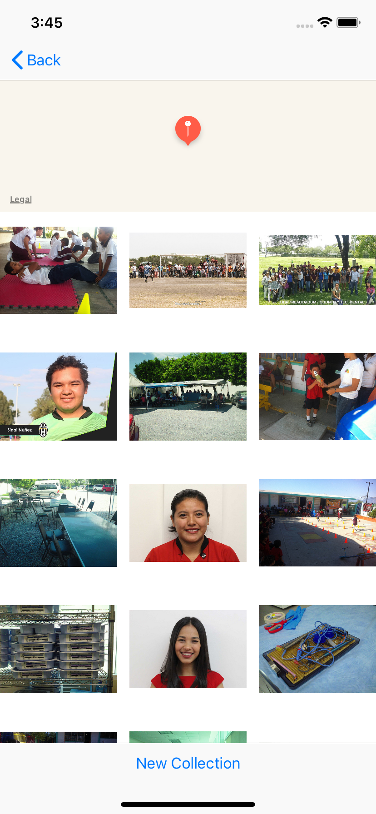

# Virtual Tourist

Before you take your next vacation, try out Virtual Tourist as a way to see some images of the possible places you can go.  Drop pins anywhere in the world, and you will see images for that location.  You can also customize these images for each pin by deleting or pulling new photos.

## **Pin Collection Map**

This view contains a map view that is populated with pins that have been saved to the device when users first drop them.  Long pressing the map will drop a pin and transition to the next view.  Tapping an existing pin will also transition to the next view.

## **Photo Collection View**
This view contains a small map view with the selected pin at the center. The map is zoomed in to give the user better visibility of the location they are looking at.  The view also contains a collection view that is populated with images from the location of the pin.  If the pin is new, the images are downloaded from the Flickr API and stored on the device using CoreData.  If the pin already exists the images are loaded from the persistent store using CoreData. Tapping an image will delete it from the view and the persistent store.  Tapping the "New Collection" button will delete all the images in the collection and the persistent store for that pin, and then new photos will be downloaded from the Flickr API for the same location.

## **Build Instructions**
N/A

## **Testing Instructions**
N/A
